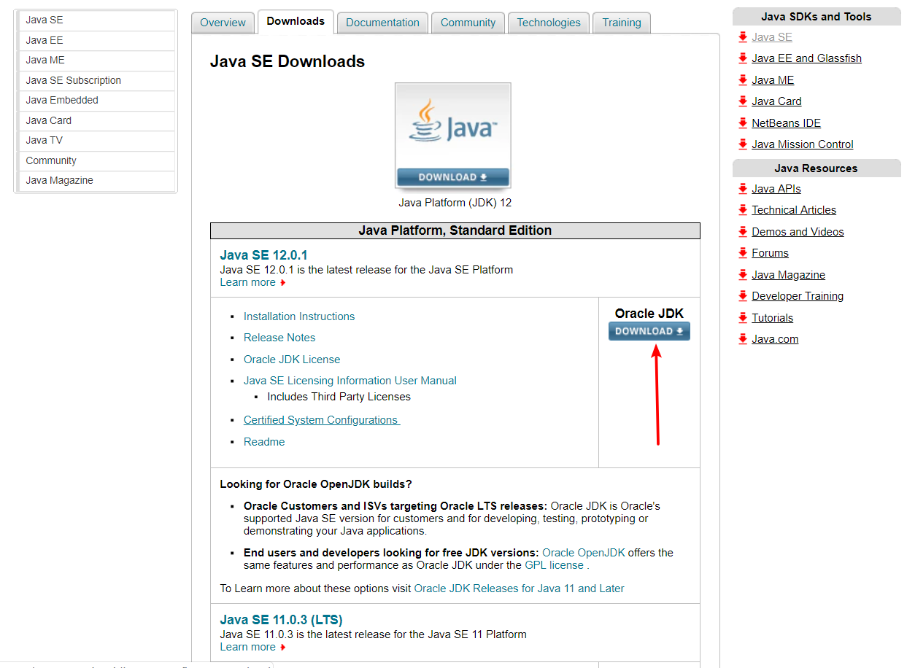
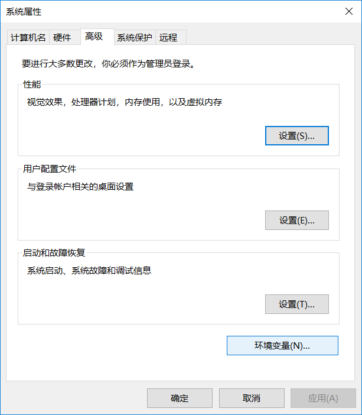

## Java环境配置
***当前配置换进为Win10环境下***

### 下载Java `jdk`
你可以到甲骨文官方网站进行下载安装包如图
[甲骨文官方网站](https://www.oracle.com/technetwork/java/javase/downloads/index.html)选择 **DOWNLOAD** 按钮
<div align="center">
在进入下载页面后，你可以选择你需要的版本以及平台,如果你是32位系统那么就下载32位即`X86`的软件包，如果是64位系统那就下载`x86_64`或是`x64`，windows系统下载完成后就可以直接点击运行如果你下载的是可执行程序(`.exe`)的话，就直接傻瓜式操作直接点击下一步(next)，如果你下载的是压缩包(`.zip`)，那么把文件解压后放到你指定的目录下，如我把文件解压后发到了系统盘的程序文件夹下
<div align="center">    
<div align="center">
这是Java解压后所在的目录,就以当前目录为例。

### 配置环境
打开这台电脑,然后点击属性
<div align="center">


然后我们可以看到旁边的几个选项,选择高级系统设置，点击后你就可以打开系统属性面板，然后可以看到环境变量按钮，我们选择环境变量按钮打开后就可以编辑环境变量了
我们点击`新建(W)`按钮,然后将环境变量名设置为`JDK_HOME`(其实变量名你可以随意设置,只是这样设置可以见名思义,避免日后混淆)然后将变量值设置为jdk所在路径,比如我的`JDK`路径像这样
<div align="center">

那么我的环境变量的变量值则需要设置为如下
<div align="center">
变量值就是JDK所在路径
然后配置另外一个环境变量名
    <div align="center">
再将配置好的`JAVA_HOME`添加到系统环境变量下,系统环境变量变量名为`Path`，在找到变量名为`Path`的变量后，点击进去,然后再点击新建,输入你定义好的环境变量名`JAVA_HOME`和百分号，如下
<div align="center">

百分号表示引用变量
然后我们再退出环境变量(点击确认退出)
再在`CMD`或是`Powershell`中输入命令

```cmd
java -version
```
如果输出了Java的版本号,那就说明已经配置好了Java的系统环境了,如图
<div align="center">
